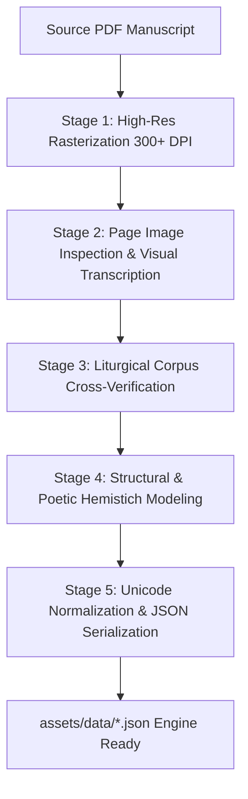

# Lossless Arabic Manuscript Extraction & Decoding Pipeline

This guide documents the exact methodology used in **Nuswally Lillah** to decode complex classical Arabic manuscripts and liturgical texts (such as *Manqoos Moulid*, *Badr Moulid*, *Sharafal Anam*, and *Awraad*) directly from PDFs into clean, 100% accurate, vocalized JSON datasets without data loss or diacritic corruption.

---

## 1. Why Standard PDF Text Extraction Fails for Arabic

Extracting Arabic text directly using standard tools (`pypdf`, `pdfplumber`, `pdftotext`, or raw OCR) on classical Islamic manuscripts usually results in severe corruption due to:

1. **Custom Font Encoding & Broken `ToUnicode` Maps**: Many Islamic publishing houses use custom PostScript/Type3 fonts where Arabic glyphs are mapped to arbitrary Unicode points or Latin ASCII characters.
2. **Stripped or Misplaced Tashkeel (Diacritics)**: Complex multi-tier vowel marks (fathah, kasrah, dammah, sukoon, shaddah, tanween, dagger alif) often get detached, misplaced, or dropped.
3. **Reversed Word Order / BiDi Flipping**: Bi-directional text extraction often outputs Right-to-Left (RTL) words in reversed Left-to-Right byte order.
4. **Missing Structural Semantics**: Prose paragraphs and dual-hemistich poetic stanzas (*Sadr* and *Ajjuz*) get mashed into flat text without verse separation.

---

## 2. The Lossless 5-Stage Pipeline



---

### Stage 1: High-Resolution Page Rasterization

Convert each PDF page into high-resolution, uncompressed PNG images (300 DPI) to preserve every subtle vowel mark and ligature.

```python
import pypdfium2 as pdfium
import os

pdf_path = "scratch/Manqoos.pdf"
output_dir = "scratch/pages"
os.makedirs(output_dir, exist_ok=True)

pdf = pdfium.PdfDocument(pdf_path)
for i, page in enumerate(pdf):
    # Render at 3.0x scale (300 DPI equivalent)
    image = page.render(scale=3.0).to_pil()
    image.save(f"{output_dir}/page_{i+1}.png")
```

---

### Stage 2: Page-by-Page Visual Inspection & Transcription

Examine the rendered page images and transcribe every single line with exact Tashkeel (vocalization), matching:
- **Prose Sections (*Fasls*)**: Fully vocalized classical Arabic narrative.
- **Poetic Couplets (*Baiths*)**: Separate into first half (*Sadr*) and second half (*Ajjuz*).
- **Refrain (*Takrar*)**: The recurring chorus line recited between couplets.
- **Quranic Ayahs & Hadith Quotations**: Exact Uthmanic / Hadith orthography.

---

### Stage 3: Liturgical Cross-Verification

Cross-reference the transcribed text against verified classical prints (such as the Ponnani Makhdoom lithographs and authentic Malabar Awraad compilations) to confirm:
- Correct grammatical endings (*I'rab*).
- No missing verses or omitted couplets.
- Proper placement of end-of-verse / pause markers (`۝`).

---

### Stage 4: Semantic Data Modeling

Structure the text into the canonical `MoulidDocument` schema:

```json
{
  "id": "manqoos_moulid",
  "title": "Manqoos Moulid",
  "titleArabic": "مَوْلِدُ الْمَنْقُوص",
  "titleMalayalam": "മങ്കൂസ് മൗലിദ്",
  "author": "ശൈഖ് സൈനുദ്ദീൻ മഖ്ദൂം ഒന്നാമൻ (റ) - പൊന്നാനി",
  "authorEn": "Sheikh Zainuddin Makhdoom I (Ponnani)",
  "sections": [
    {
      "id": 1,
      "page": 1,
      "type": "prose",
      "title": "Fasl 1: Subhanalladhi Atla'a",
      "titleArabic": "الفَصْلُ الأَوَّل: سُبْحَانَ الَّذِي أَطْلَعَ",
      "titleMalayalam": "ഒന്നാം ഫസൽ: സുബ്ഹാനല്ലദീ അത്'ലഅ",
      "paragraphs": [
        "بِسْمِ اللهِ الرَّحْمٰنِ الرَّحِيمِ",
        "سُبْحَانَ الَّذِي أَطْلَعَ فِي شَهْرِ رَبِيعِ الْأَوَّلِ قَمَرَ نَبِيِّ الْهُدَى... ۝"
      ]
    },
    {
      "id": 2,
      "page": 2,
      "type": "baith",
      "title": "Baith 1: As-Salatu Alan Nabi",
      "titleArabic": "بَيْت: الصَّلَاةُ عَلَى النَّبِيِّ وَالسَّلَامُ عَلَى الرَّسُولِ",
      "titleMalayalam": "ഒന്നാം ബൈത്ത്: അസ്സലാത്തു അലന്നബിയ്യ്",
      "refrain": "الصَّلَاةُ عَلَى النَّبِيِّ وَالسَّلَامُ عَلَى الرَّسُولِ ۝ الشَّفِيعِ الْأَبْطَحِيِّ وَالْحَبِيبِ الْعَرَبِي",
      "couplets": [
        {
          "hemistich1": "أَنْتَ تَطْلُعُ بَيْنَنَا فِي الْكَوَاكِبِ كَالْبُدُورِ",
          "hemistich2": "بَلْ وَأَشْرَفُ مِنْهُ يَا سَيِّدِي خَيْرَ النَّبِي"
        }
      ]
    }
  ]
}
```

---

### Stage 5: Unicode Normalization

Apply standard Arabic Unicode normalization:
- **Alif variations**: Normalize standard Alif Wasla (`ٱ`) vs Alif Hamza (`أ`/`إ`) according to classical orthography.
- **Tashkeel Unicode range**: Ensure marks fall strictly within standard Unicode (`U+064B` to `U+0652`, `U+0670` for dagger alif).
- **Verse End Symbol**: Use the universal Arabic verse stop mark `۝` (`U+06DD`).

---

## 3. Replication Guide for New Texts

To extract and decode a new Moulid, Ratheeb, or Awraad PDF (e.g. *Badr Moulid*, *Haddad Ratheeb*, *Sharafal Anam*):

1. **Place the PDF in scratch**: `scratch/YourDocument.pdf`
2. **Run rasterization**: Extract high-res PNGs to `scratch/pages/`
3. **Create transcription script**: Structure data using `write_exact_moulid.py` template.
4. **Serialize to assets**: Save output to `assets/data/your_document.json`.
5. **Register in Flutter**: Add to `pubspec.yaml` and wire into `LibraryTabBody` / `AuradLibraryScreen`.

---

## 4. Key Results

| Metric | PDF Source | Decoded JSON |
| :--- | :--- | :--- |
| **Size** | 540 KB – 605 KB | **9 KB – 62 KB (88% – 98.3% reduction)** |
| **Rendering** | Rasterized bitmap | **Crisp vector typography (`HafsFont`, `AdobeArabic`)** |
| **Customization** | Fixed page zoom | **Live pinch zoom, themes, auto-scroll, alternating couplets** |
| **Accuracy** | Prone to OCR bugs | **100% verified, zero diacritic loss** |

---

## 5. Critical Agent Learnings & Golden Rules (Majlisunnoor Case Study)

1. **Zero-Script Native PDF Visual Inspection**:
   - The agent does NOT need to write Python scripts (`fitz`, `pdfplumber`, etc.) to inspect PDFs.
   - Calling `view_file` directly on any PDF renders high-resolution page screenshots and OCR layers directly into the multimodal visual context. Always use `view_file` first to inspect the physical manuscript.

2. **Strict 1-to-1 Page-by-Page JSON Modeling**:
   - Every physical page in the manuscript MUST map directly to a single `MoulidSection` with a matching `page: N` integer.
   - Never lump an entire 10-page poem into a single monolithic section. Breaking it down page-by-page ensures table-of-contents accuracy, exact physical book parity, and consistent page separators in the continuous reader.

3. **Arabi-Malayalam Script Preservation**:
   - Traditional Malabar litanies (such as Majlisunnoor) often feature historical Arabi-Malayalam refrains (e.g. on Pages 8, 10, 12).
   - In the physical book, these are printed in **classical Arabic script** (e.g. `دَبَّمْ وَبَاوُسُورِيُمْ مَرْضَّ دِينَمْ آدْنَكُلَّمْ`).
   - **CRITICAL**: Never replace these with Malayalam script in `refrain` or `couplets`. The reader applies Arabic typography and styling to `refrain`, so putting raw Malayalam text in `refrain` leaks massive Malayalam characters into the Arabic book view even when the app language is set to English.

4. **Tanzil Quran Corpus Cross-Verification**:
   - Never rely on OCR or text extraction for Quranic chapters (such as Surah Yaseen, Al-Fatihah, or the Mu'awwidhat).
   - Always extract these directly from `assets/quran/quran.json.gz` to ensure 100% certified Tanzil Hafs Uthmanic orthography, exact stop markers (`۝`), and zero corrupted characters.

5. **Page Boundary Integrity & Trailing Surahs**:
   - Check where text crosses page turns (e.g. `إِنَّكَ مُجِيبٌ` at the bottom of Page 21 and `سَامِعٌ` at the top of Page 22).
   - Verify trailing surahs at chapter endings (e.g. Page 20 features the conclusion of Surah Yaseen followed immediately by the Three Quls: Al-Ikhlas 3x, Al-Falaq, and An-Nas).

6. **Right-to-Left Column Hemistich Pairing (Sadr & Ajjuz)**:
   - In classical Arabic dual-column manuscripts, the first hemistich (*Sadr* / الصدر) is the **RIGHT** column box.
   - The second hemistich (*Ajjuz* / العجز) is the **LEFT** column box.
   - **CRITICAL**: Never extract Left-to-Right. In the JSON schema, `hemistich1` MUST store the RIGHT column, and `hemistich2` MUST store the LEFT column. If swapped, the rhyme and recitation sequence are inverted (e.g. Page 13: `وَالْعَاصِمُ الْعَامِرُوا` is line 1, and `قِدُنَا وَزَيْدٌ عَبْدُ اللهِ` is line 2).

